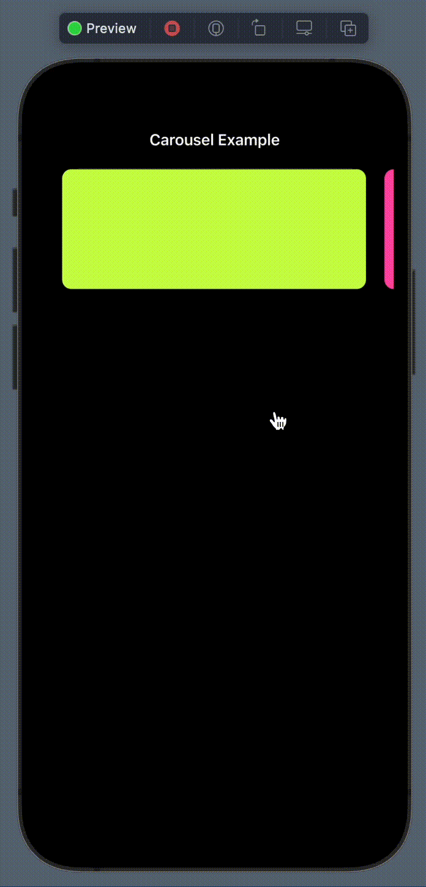
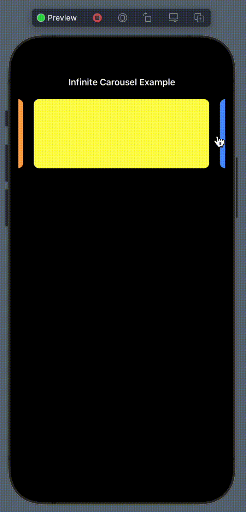
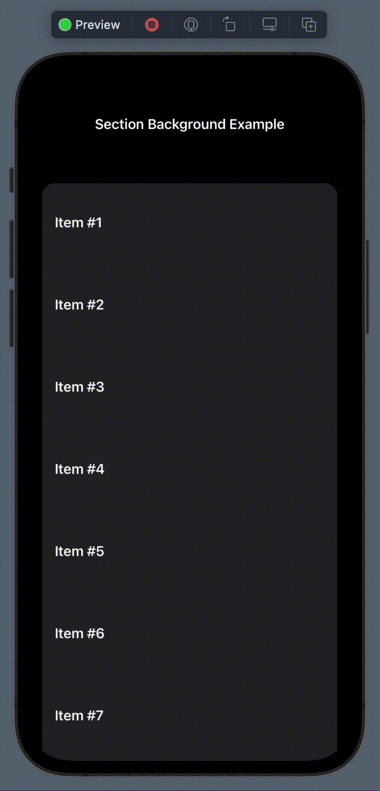
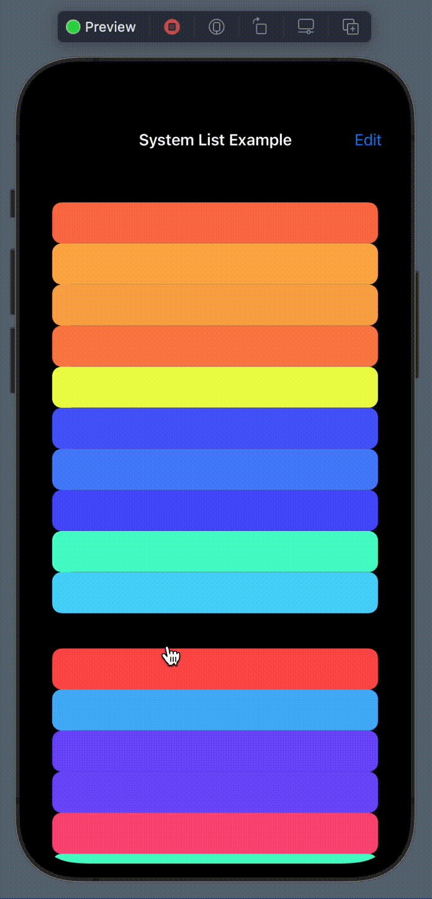

# Compositional-Layout-Examples-iOS

Compositional Layout 연습 ([참고한 레포지토리](https://github.com/nemecek-filip/CompositionalDiffablePlayground.ios))

## Carousel

  
   

## Loading Grid Layout

## Background Decoration

## Sticky Header

## System List Header

## System List Swipe

